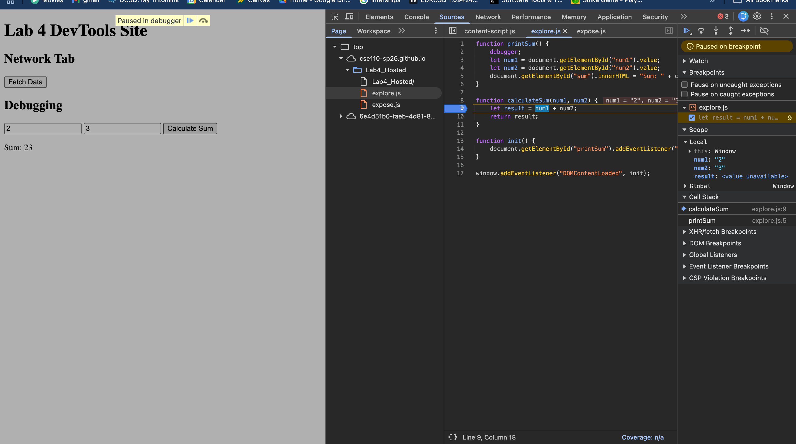

# Part 2: Variable Scope in Loops

## Question 1: What will happen at line 12 and why? If the code causes an error, explain why.

**Answer:** The code prints `3`

---

## Question 2: What will happen at line 13 and why? If the code causes an error, explain why.

**Answer:** The code prints `150`

**Explanation:** Because `var` has **function scope**, the variable remains accessible outside the loop and retains the value from the last iteration.

---

## Question 3: What will happen at line 14 and why? If the code causes an error, explain why.

**Answer:** The code prints `150`

**Explanation:** Line 14 executes `console.log(finalPrice);` and prints the value of `finalPrice`, which is `150`.

The variable `finalPrice` is declared with `var` on line 4 at the beginning of the function with an initial value of `0`. Because `var` has **function scope**, it is accessible throughout the entire function, including after the loop.
---

## Question 4: What will this function return? Give a brief explanation why. If the code causes an error, explain why.

**Answer:** The function returns `[50, 100, 150]`

---

## Question 5: What will happen at line 12 and why? If the code causes an error, explain why.

**Answer:** **The code returns a ReferenceError**: `i is not defined`

**Explanation:** Once the loop exits at line 10, the variable `i` goes out of scope and is no longer accessible.

---

## Question 6: What will happen at line 13 and why? If the code causes an error, explain why.

**Answer:** **The code returns a ReferenceError**: `discountedPrice is not defined`

**Explanation:** On line 7, `discountedPrice` is declared with `let` inside the for loop: `let discountedPrice = prices[i] * (1 - discount);`. Because `let` has **block scope**, the variable `discountedPrice` only exists within the for loop block (lines 6-10). Once the loop exits at line 10, the variable `discountedPrice` goes out of scope and is no longer accessible. 

---

## Question 7: What will happen at line 14 and why? If the code causes an error, explain why.

**Answer:** The code prints `150`

---

## Question 8: What will this function return? Give a brief explanation. If the code causes an error, explain why.

**Answer:** The function returns `[50, 100, 150]`

---

## Question 9: What will happen at line 11 and why? If the code causes an error, explain why.

**Answer:** **The code returns a ReferenceError**: `i is not defined`

**Explanation:** On line 6, the variable `i` is declared with `let` inside the for loop: `for (let i = 0; i < length; i++)`. Because `let` has **block scope**, the variable `i` only exists within the for loop block (lines 6-9).

Once the loop exits at line 9, the variable `i` goes out of scope and is no longer accessible. When line 11 tries to execute `console.log(i);`, it throws a **ReferenceError: i is not defined** because `i` no longer exists in the function scope.

---

## Question 10: What will happen at line 12 and why? If the code causes an error, explain why.

**Answer:** The code prints `3`

---

## Question 11: What will this function return? Give a brief explanation. If the code causes an error, explain why.

**Answer:** The function returns `[50, 100, 150]`

---

## Part 2 Continued: Object Property Access

Given the following object:
```javascript
let student = {
    name: 'Sarah',
    major: 'Computer Science',
    'Grad Year': '2022',
    greeting: function() { console.log('Hello!'); },
    'Favorite Teacher': {
        name: 'Thomas Powell',
        course: 'CSE 110'
    },
    courseLoad: ['CSE 110', 'CSE 134', 'VIS 41']
};
```

### 1. Accessing the value of the name property in the student object

**Notation:** `student.name`

**Result:** `'Sarah'`

---

### 2. Accessing the value of the Grad Year property in the student object

**Notation:** `student['Grad Year']`

**Result:** `'2022'`

---

### 3. Calling the function for the greeting property in the student object

**Notation:** `student.greeting()`

**Result:** Logs `'Hello!'` to the console

---

### 4. Accessing the name property of the object in the Favorite Teacher property in student

**Notation:** `student['Favorite Teacher'].name`

**Result:** `'Thomas Powell'`

---

### 5. Access index zero in the array of the courseLoad property of the student object

**Notation:** `student.courseLoad[0]`

**Result:** `'CSE 110'`

---

## Part 2 Continued

### Arithmetic Operations

#### 1. `'3' + 2`

**Output:** `'32'`

**Explanation:** When adding a string and a number with the `+` operator, JavaScript converts the number to a string and concatenates them. The string `'3'` and number `2` become `'3'` and `'2'`, resulting in `'32'`.

---

#### 2. `'3' - 2`

**Output:** `1`

**Explanation:** The `-` operator is used for subtraction, not string concatenation. JavaScript converts the string `'3'` to the number `3`, then performs the arithmetic operation: `3 - 2 = 1`.

---

#### 3. `3 + null`

**Output:** `3`

**Explanation:** `null` is converted to the number `0` in arithmetic operations. Therefore: `3 + 0 = 3`.

---

#### 4. `'3' + null`

**Output:** `'3null'`

**Explanation:** The `+` operator triggers string concatenation when either operand is a string. `null` is converted to the string `'null'`, so the result is `'3' + 'null' = '3null'`.

---

#### 5. `true + 3`

**Output:** `4`

**Explanation:** The boolean `true` is converted to the number `1` in arithmetic operations. Therefore: `1 + 3 = 4`.

---

#### 6. `false + null`

**Output:** `0`

**Explanation:** Both `false` and `null` are converted to `0` in arithmetic operations. Therefore: `0 + 0 = 0`.

---

#### 7. `'3' + undefined`

**Output:** `'3undefined'`

**Explanation:** The `+` operator triggers string concatenation when either operand is a string. `undefined` is converted to the string `'undefined'`, so the result is `'3' + 'undefined' = '3undefined'`.

---

#### 8. `'3' - undefined`

**Output:** `NaN`

**Explanation:** The `-` operator is used for subtraction. JavaScript attempts to convert `'3'` to `3` and `undefined` to a number. However, `undefined` cannot be meaningfully converted to a number, resulting in `NaN` (Not a Number). The operation becomes `3 - NaN = NaN`.

---

### Comparison Operations

#### 1. `'2' > 1`

**Output:** `true`

**Explanation:** When comparing a string and a number, JavaScript converts the string to a number. `'2'` becomes `2`, so the comparison is `2 > 1`, which is `true`.

---

#### 2. `'2' < '12'`

**Output:** `false`

**Explanation:** When comparing two strings, JavaScript performs a lexicographical (alphabetical) comparison, not a numerical one. Comparing character by character: `'2'` vs `'1'`. Since `'2'` comes after `'1'` in ASCII, `'2' < '12'` is `false`.

---

#### 3. `2 == '2'`

**Output:** `true`

**Explanation:** The `==` operator performs loose equality comparison with type coercion. The string `'2'` is converted to the number `2`, so the comparison becomes `2 == 2`, which is `true`.

---

#### 4. `2 === '2'`

**Output:** `false`

**Explanation:** The `===` operator performs equality comparison without type coercion. It checks both value and type. `2` (number) is not strictly equal to `'2'` (string) because they have different types, so the result is `false`.

---

#### 5. `true == 2`

**Output:** `false`

**Explanation:** The `==` operator uses type coercion. `true` is converted to `1`, not `2`. Therefore: `1 == 2` is `false`.

---

#### 6. `true === Boolean(2)`

**Output:** `true`

**Explanation:** The `===` operator performs strict comparison. `Boolean(2)` converts the number `2` to a boolean. Since `2` is a truthy value, `Boolean(2)` returns `true`. Therefore: `true === true` is `true`.

---

### Difference between `==` and `===`

**`==`
- Compares values with type coercion
- JavaScript automatically converts types to compare values
- Example: `2 == '2'` is `true` because the string is converted to a number

**`===`
- Compares both value AND type without any coercion
- Both the value and the data type must match exactly
- Example: `2 === '2'` is `false` because one is a number and one is a string

---

## Part 2 Continued: Callbacks and Higher-Order Functions

### Question 17: Callback Function Result

Given the following code:
```javascript
function modifyArray(array, callback) {
    const newArr = [];
    for (let i = 0; i < array.length; i++) {
        newArr.push(callback(array[i]));
    }
    return newArr;
}

function doSomething(num) {
    return num * 2;
}

modifyArray([1,2,3], doSomething);
```

**Result:** `[2, 4, 6]`

**Walkthrough:**

1. `modifyArray([1,2,3], doSomething)` is called
   - `array = [1, 2, 3]`
   - `callback = doSomething` (the function is passed as a parameter)

2. Inside `modifyArray`, `newArr = []` is initialized

3. **First iteration (i=0):**
   - `callback(array[0])` → `doSomething(1)` → returns `1 * 2 = 2`
   - `newArr.push(2)` → `newArr = [2]`

4. **Second iteration (i=1):**
   - `callback(array[1])` → `doSomething(2)` → returns `2 * 2 = 4`
   - `newArr.push(4)` → `newArr = [2, 4]`

5. **Third iteration (i=2):**
   - `callback(array[2])` → `doSomething(3)` → returns `3 * 2 = 6`
   - `newArr.push(6)` → `newArr = [2, 4, 6]`

6. Loop ends and `return newArr` returns `[2, 4, 6]`

---

## Part 2 Continued:

### Question 18

Given the following code:
```javascript
function printNums() {
    console.log(1);
    setTimeout(function() { console.log(2); }, 1000);
    setTimeout(function() { console.log(3); }, 0);
    console.log(4);
}

printNums();
```

**Output:**
```
1
4
3
2
```


